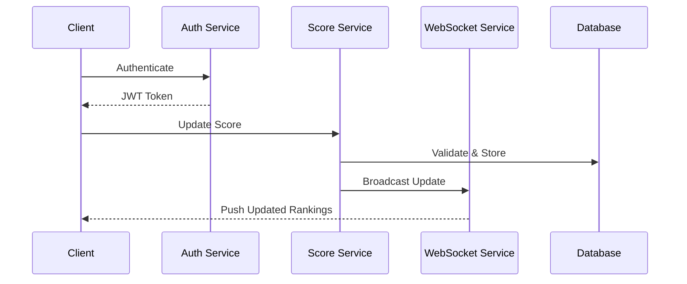

# Live Scoreboard API Module Specification

## Overview
This module handles real-time score updates and maintains a live scoreboard showing the top 10 users. The system ensures secure score updates and efficient real-time data distribution.

## System Architecture

### Components
1. **Authentication Service**
   - Handles user authentication
   - Validates API requests
   - Issues and validates JWT tokens

2. **Score Management Service**
   - Processes score updates
   - Maintains score integrity
   - Calculates rankings

3. **Real-time Broadcasting Service**
   - Manages WebSocket connections
   - Broadcasts score updates to connected clients
   - Handles connection state management

## API Endpoints

### 1. Score Update

```
POST /api/v1/scores/update
Authorization: Bearer <JWT_TOKEN>
Request Body:
{
    "actionId": string,
    "timestamp": number
}
Response:
{
    "success": boolean,
    "newScore": number,
    "rank": number
}
```
### 2. Get Top Scores

```
GET /api/v1/scores/top
Authorization: Bearer <JWT_TOKEN>
Response:
{
    "rankings": [
        {
        "userId": string,
        "username": string,
        "score": number,
        "rank": number
        }
    ]
}
```

### WebSocket Connection

```
WS /ws/scoreboard
Authorization: Bearer <JWT_TOKEN>

// Server pushes updates in format:
{
    "type": "SCORE_UPDATE",
    "data": {
        "rankings": [
            {
                "userId": string,
                "username": string,
                "score": number,
                "rank": number
            }
        ]
    }
}
```

## Security Measures

1. **Authentication**
   - JWT-based authentication required for all endpoints
   - Tokens include user identification and permissions

2. **Rate Limiting**
   - Maximum 10 score updates per minute per user
   - IP-based rate limiting for API endpoints

3. **Action Validation**
   - Each score update must include a valid actionId
   - Duplicate actionIds are rejected
   - Server-side validation of action legitimacy

## Data Flow Diagram



## Implementation Notes

1. **Database Considerations**
   - Use Redis for caching top scores
   - Implement atomic operations for score updates
   - Regular persistence to primary database

2. **Scaling Considerations**
   - Horizontal scaling of WebSocket servers
   - Load balancing for API endpoints
   - Caching strategy for frequently accessed data

3. **Monitoring Requirements**
   - Track WebSocket connection health
   - Monitor score update latency
   - Alert on unusual score patterns

## Improvement Suggestions

1. **Performance**
   - Implement score update batching
   - Use server-side events as WebSocket fallback
   - Cache user rankings for faster retrieval

2. **Security**
   - Implement request signing for score updates
   - Add fraud detection system
   - Regular security audits

3. **Features**
   - Add historical rankings
   - Implement achievement system
   - Add regional leaderboards

## Error Handling

1. **API Errors**
   - Standard HTTP status codes
   - Detailed error messages
   - Error logging and monitoring

2. **WebSocket Errors**
   - Automatic reconnection
   - Connection state management
   - Fallback mechanisms

